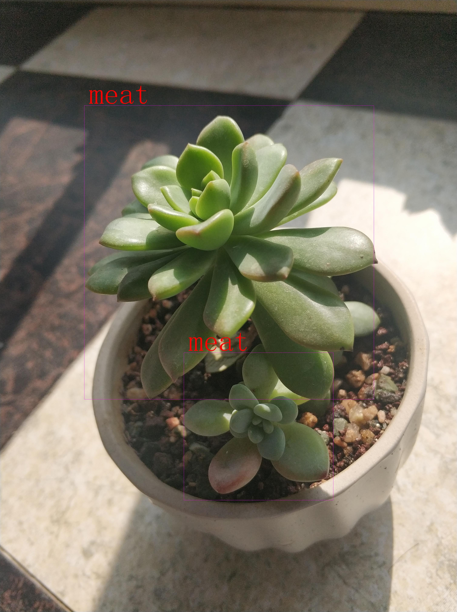

本工程将相机拍照的图片带有旋转信息进行矫正，其xml标签坐标也随之进行改变。
在此工程下面可以直接将src作为包导入代码中，本人也在其里面写了一个主函数，运行src.py会在picture文件夹下面保存demo.jpg图片
```
python src.py
```
下面是原始图片带有旋转信息和标签

下面是将旋转信息矫正后图片和标签


#### Thanks:
+ https://github.com/ageitgey/image_to_numpy
+ https://blog.csdn.net/qq_43188211/article/details/99683775
